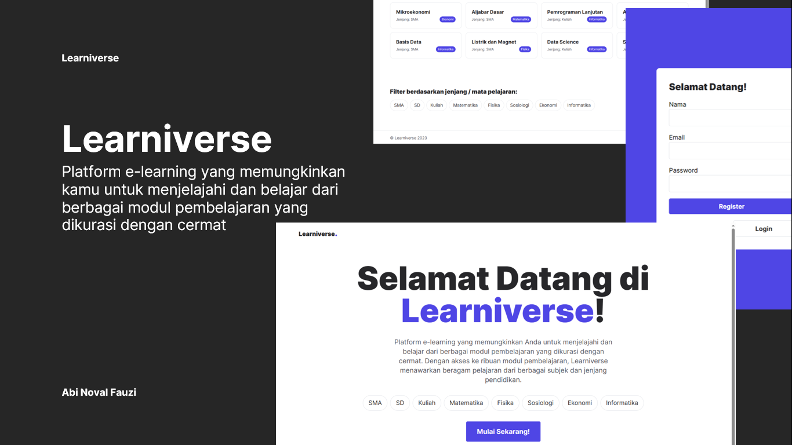

# Learniverse - Platform E-Learning Terlengkap

Selamat datang di Learniverse - Platform E-Learning Terlengkap! Learniverse adalah platform e-learning yang revolusioner, didedikasikan untuk memberikan akses pendidikan yang berkualitas kepada semua orang. Learniverse menyediakan ribuan modul pembelajaran yang kaya dan beragam, mencakup berbagai pelajaran dan jenjang pendidikan.

## Fitur Utama

-   **Autentikasi (Authentication):** Learniverse menyediakan fitur autentikasi yang memungkinkan pengguna untuk membuat akun pribadi dan masuk ke platform dengan aman.
-   **Rekomendasi Modul (Module Recommendations):** Learniverse menggunakan kecerdasan buatan (AI) untuk memberikan rekomendasi modul pembelajaran yang disesuaikan dengan minat dan sejarah baca pengguna.
-   **Filter Berdasarkan Jenjang dan Subjek/Mata Pelajaran:** Learniverse menyediakan filter yang memungkinkan pengguna untuk mencari modul pembelajaran berdasarkan jenjang pendidikan dan subjek/mata pelajaran.

## Pengembangan Selanjutnya

Berikut adalah beberapa pengembangan yang direncanakan untuk Learniverse:

1. **Validasi Input:** Menambahkan fitur validasi input pada platform untuk memastikan input yang valid dan menghindari kesalahan pengguna.
2. **Pengembangan Fitur Rekomendasi:** Melanjutkan pengembangan fitur rekomendasi untuk meningkatkan personalisasi dan kualitas rekomendasi modul pembelajaran.
3. **Pemperbaikan UI/UX Desain:** Fokus pada pemperbaikan UI/UX desain untuk meningkatkan pengalaman pengguna dengan tata letak yang intuitif, navigasi yang mudah, dan desain yang menarik.
4. **Update Profile:** Menambahkan fitur update profile yang memungkinkan pengguna untuk mengatur dan memperbarui informasi profil mereka, seperti nama, foto profil, dan preferensi pengguna.
5. **Search Modul:** Menambahkan fitur pencarian modul yang memungkinkan pengguna untuk dengan mudah mencari modul pembelajaran berdasarkan kata kunci.
6. **Latihan Soal:** Menambahkan fitur latihan soal yang memungkinkan pengguna untuk menguji pemahaman mereka dengan latihan soal interaktif yang terkait dengan modul pembelajaran yang telah mereka pelajari.
7. **Manajemen User oleh Admin:** Menambahkan fitur manajemen user oleh admin yang memungkinkan administrator untuk mengelola pengguna, termasuk pembuatan akun baru, pengaturan hak akses, dan penghapusan akun.

## Cara Penggunaan

### Login ke Akun Learniverse

1. Buka Learniverse di browser web.
2. Klik tombol "Login" di pojok kanan atas halaman.
3. Masukkan alamat surel dan kata sandi yang telah kamu daftarkan saat membuat akun (jika belum mempunyai akun, silakan klik register).
4. Klik tombol "Login" untuk masuk ke akun Learniverse.

### Menjelajahi Modul Pembelajaran

1. Setelah berhasil login, kamu akan diarahkan ke beranda Learniverse.
2. Di beranda, kamu dapat melihat daftar modul pembelajaran yang tersedia.
3. Gunakan filter berdasarkan jenjang dan subjek/mata pelajaran untuk menyaring modul yang sesuai dengan minat dan kebutuhan kamu.
4. Klik pada judul modul untuk membuka halaman detailnya.
5. Pada halaman detail modul, kamu akan menemukan deskripsi, konten, dan sumber-sumber referensi yang terkait dengan modul tersebut.
6. kamu dapat menavigasi melalui konten modul menggunakan tautan-tautan yang disediakan.
7. Jelajahi semua materi yang tersedia dalam modul tersebut, seperti teks, gambar, video, atau tugas interaktif.

Dengan mengikuti langkah-langkah di atas, kamu dapat menggunakan akun Learniverse untuk login dan menjelajahi berbagai modul pembelajaran yang tersedia. Selamat belajar di Learniverse!

## Teknologi dan Framework

Learniverse dikembangkan menggunakan teknologi dan framework terkini untuk memberikan pengalaman e-learning yang terbaik kepada penggunanya. Berikut adalah beberapa teknologi dan framework yang digunakan dalam pengembangan Learniverse:

-   **Laravel:** Learniverse dibangun dengan menggunakan Laravel, sebuah kerangka kerja (framework) PHP yang kuat dan populer. Laravel memberikan fondasi yang kokoh untuk pengembangan aplikasi web, dengan fitur-fitur seperti routing, manajemen basis data, autentikasi, dan banyak lagi.

-   **Tailwind CSS:** Learniverse menggunakan Tailwind CSS sebagai framework CSS yang digunakan untuk desain antarmuka pengguna (UI). Tailwind CSS menyediakan serangkaian kelas utilitas yang kuat, memungkinkan pengembang untuk dengan mudah membangun tampilan yang responsif dan konsisten.

-   **MySQL:** Learniverse menggunakan MySQL sebagai sistem manajemen basis data untuk menyimpan dan mengelola data pengguna, modul pembelajaran, dan informasi lainnya. MySQL adalah salah satu database relasional yang paling populer, dengan performa yang baik dan dukungan yang luas.

## Instalasi Lokal

Berikut adalah langkah-langkah untuk menginstal Learniverse di lingkungan lokal:

1. Clone repositori Learniverse ke direktori lokal:

```bash
git clone https://github.com/abnvlf/sevima-learniverse.git
```

2. Masuk ke direktori Learniverse:

```bash
cd learniverse
```

3. Jalankan perintah composer install untuk menginstal semua dependensi PHP:

```bash
composer install
```

4. Jalankan perintah npm install untuk menginstal semua dependensi JavaScript:

```bash
npm install
```

5. Salin file `.env.example` menjadi `.env`:

```bash
cp .env.example .env
```

6. Generate kunci aplikasi baru dengan perintah berikut:

```bash
php artisan key:generate
```

7. Buka file .env dan atur kredensial basis data sesuai dengan konfigurasi kamu:

```bash
DB_CONNECTION=mysql
DB_HOST=127.0.0.1
DB_PORT=3306
DB_DATABASE=learniverse
DB_USERNAME=root
DB_PASSWORD=
```

8. Jalankan migrasi basis data dan isi dengan data dummy menggunakan perintah berikut:

```bash
php artisan migrate:fresh --seed
```

9. Learniverse siap untuk dijalankan di lingkungan lokal. Jalankan server PHP dengan perintah berikut:

```bash
php artisan serve
```

10. Untuk mengkompilasi aset JavaScript, jalankan perintah npm run dev:

```bash
npm run dev
```

Setelah langkah-langkah di atas selesai, kamu dapat mengakses Learniverse melalui browser web dengan alamat http://localhost:8000.

### Credential Login Dummy

Kamu dapat menggunakan kredensial login dummy berikut untuk mengakses Learniverse di lingkungan lokal:

#### Admin:

-   Email: admin@example.com
-   Password: password

#### User:

-   Email: user@example.com
-   Password: password

## Kontribusi

Kami sangat menghargai kontribusi dari para pengembang untuk meningkatkan Learniverse. Jika kamu tertarik untuk berkontribusi, silakan baca [Panduan Kontribusi](CONTRIBUTING.md) kami untuk informasi lebih lanjut.

## Lisensi

Learniverse tersedia di bawah lisensi [MIT](LICENSE). Silakan merujuk ke berkas LICENSE untuk detail lebih lanjut.
